# Neural Network Charity Analysis
This project focused on the application of various neural network algorithms and deep learning neural network models for performing efficient ETL and solving a real-world case study.

## Table of Contents

- [Overview of Project](#overview-of-project)
  - [Resources](#resources)
  - [Challenge Overview](#challenge-overview)
- [Preprocessing Data for a Neural Network Model](#preprocessing-data-for-a-neural-network-model)
  - [Preprocessing *application_df* DataFrame](#preprocessing-application_df-dataframe)
  - [Encoding Categorical Columns](#encoding-categorical-columns)
- [Compiling, Training, and Evaluating the Model](#compiling-training-and-evaluating-the-model)
- [Optimization of the Model](#optimization-of-the-model)
  - [Using Deep Neural Networks](#using-deep-neural-networks)
  - [Results](#results)
- [Summary](#summary)
  - [Data Preprocessing](#data-preprocessing)
  - [Summary on Compiling, Training, and Evaluating the Model](#summary-on-compiling-training-and-evaluating-the-model)
  - [Conclusion and Recommendation](#conclusion-and-recommendation)
- [References](#references)

## Overview of Project

This project and Module 20 assignment focused on cultivating knowledge and skills in data preparation, standardization, binary encoding, machine learning (ML), and neural networks (NN), which were required for solving a real-world challenge: predicting where to make investments and whether applicants would be successful if funded by Alphabet Soup. During the completion of this project we particularly leveraged the powerful features offered by [TensorFlow Documentation](https://www.tensorflow.org/guide/), [Scikit-learn User Guide - Supervised Learning](https://scikit-learn.org/stable/supervised_learning.html), and their supporting packages/libraries/dependencies that let us explore, train, and study various NN models and resources, such as preprocessing/encoding, designing a NN model, optimizing a multi-layered NN model, and saving/sharing a NN model.

### Resources

- Source code: [AlphabetSoupCharity.ipynb](./AlphabetSoupCharity.ipynb), [AlphabetSoupCharity_Optimization.ipynb](./AlphabetSoupCharity_Optimization.ipynb).
- Source data: [charity_data.csv](./Resources/charity_data.csv).
- Image file: png files.
- Software: [Pandas User Guide](https://pandas.pydata.org/pandas-docs/stable/user_guide/index.html#user-guide), [TensorFlow Documentation](https://www.tensorflow.org/guide/), [Scikit-learn User Guide - Supervised Learning](https://scikit-learn.org/stable/supervised_learning.html), [Matplotlib - Plot types](https://matplotlib.org/stable/plot_types/index.html).

The csv file contained more than 34000 organizations that have received funding from Alphabet Soup over the years. Within this dataset were a number of columns that capture metadata about each organization, such as the following:

- *EIN* and *NAME* — Identification columns
- *APPLICATION_TYPE* — Alphabet Soup application type
- *AFFILIATION* — Affiliated sector of industry
- *CLASSIFICATION* — Government organization classification
- *USE_CASE* — Use case for funding
- *ORGANIZATION* — Organization type
- *STATUS* — Active status
- *INCOME_AMT* — Income classification
- *SPECIAL_CONSIDERATIONS* — Special consideration for application
- *ASK_AMT* — Funding amount requested
- *IS_SUCCESSFUL* — Was the money used effectively

### Challenge Overview

Below is the outline of our deliverables and a written report for presenting our results and analysis summary.

- ☑️ Deliverable 1: Preprocessing Data for a Neural Network Model.
- ☑️ Deliverable 2: Compile, Train, and Evaluate the Model.
- ☑️ Deliverable 3: Optimize the Model.
- ☑️ Deliverable 4: A Written Report on the Neural Network Model (this ["README.md"](./README.md)).

## Preprocessing Data for a Neural Network Model

Using our knowledge of the Python Pandas and scikit-learn preprocessing libraries, we read in the csv data as a DataFrame, cleaned the data, filtered a few unrelated entries, reshaped the original dataset, and performed the standardization and scaling processes. The source code can be reviewed in [AlphabetSoupCharity.ipynb](./AlphabetSoupCharity.ipynb), which I used to efficiently accomplish the data cleaning and preprocessing steps. The cleaned data were later passed down to several NN models and some optimization techniques that we studied.

### Preprocessing *application_df* DataFrame

After importing the required dependencies, we read the csv data as a DataFrame called *application_df*. The transformation from the original dataset to the standardized and scaled dataset is summarized below.

- **34299** rows and **12** columns at the start of data preprocessing steps.
- The knee point of the *APPLICATION_TYPE* counts was first set at T10 (528) as illustrated in Fig. 1. Everything else smaller than 528 was then grouped as *Other* to minimize the number of bins.
- Based on the density plot of *CLASSIFICATION* counts, 1000 was selected as the cutoff point (Fig. 2) where any count smaller than 1000 was grouped as *Other* to minimize the number of bins.
- As part of the preprocessing steps, *ASK_AMT* data were characterized as containing many outliers beyond the 1.5 interquartile ratio (IQR) boundaries below the 1<sup>st</sup> quartile (Q1) and above the 3<sup>rd</sup> quartile (Q3). The distribution of *ASK_AMT* data was found to be extremely right skewed, where the mean (**2.769199e+06**) was much larger than the median (**5.0e+03**) as depicted in Fig. 3(b). The boxplot in Fig. 3(a) indicates that the majority of possible outliers were from those high outliers.
- The shape of the cleaned *application_df* DataFrame was **(34299, 44)** at the end of binning, one-hot encoding, and preprocessing steps (**Table 1**).

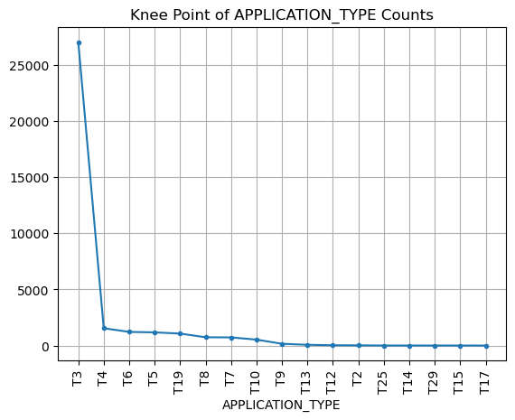  
**Fig. 1 Knee point of *APPLICATION_TYPE* counts.**

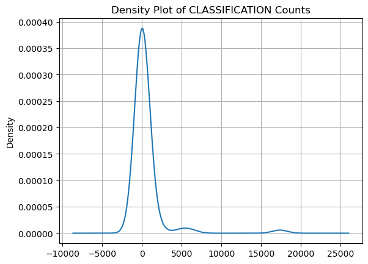  
**Fig. 2 Density plot of *Classification* counts.**

**Table 1. First 5 rows of the preprocessed and scaled *application_df* DataFrame.**  
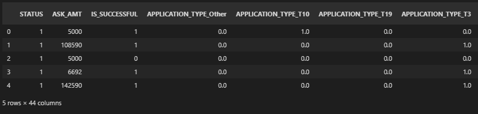

<hr>
<table><tr><td>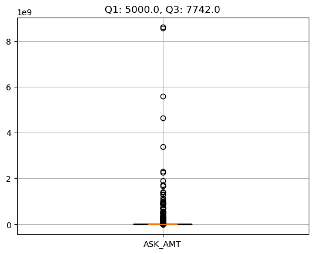</td><td>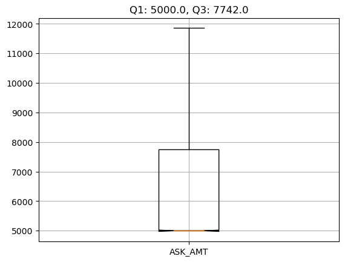</td></tr></table>

**Fig. 3 Boxplots of *ASK_AMT* amount (a) including all outliers and (b) excluding outliers.**
<hr>

### Encoding Categorical Columns

We adopted sklearn.preprocessing `OneHotEncoder` method for encoding the categorical columns containing string values into binary features and the StandardScaler method for standardizing and scaling the data as illustrated in the following code snippet. Our feature data were mostly scaled to a mean near zero and unit variance by the StandardScaler method.

## Compiling, Training, and Evaluating the Model

After the preprocessing, encoding, and scaling steps, we defined our NN model, compiled, trained, and evaluated the model. In this analysis, `random_state=78` was globally adopted across all models that we evaluated. The comparison of each model and our analysis results are detailed below.

<hr>
<table><tr><td>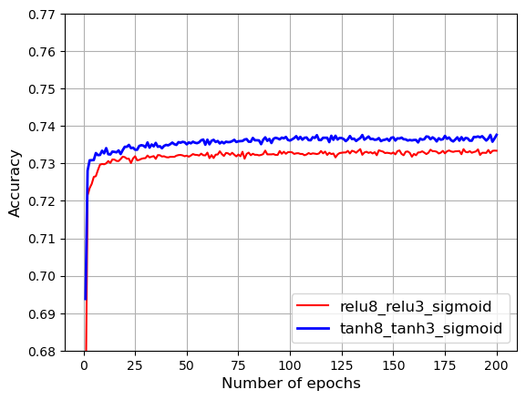</td><td>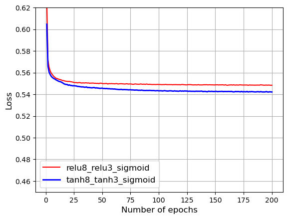</td></tr></table>

**Fig. 4 Comparison of (a) Accuracy and (b) Loss of the NN models with relu+relu+sigmoid vs. tahn+tanh+sigmoid activation functions (Total neurons in input-layer1-layer2: 43-8-3. Total epochs: 200).**
<hr>

Fig. 4 highlights the difference between two preliminary NN models that we have analyzed. Before some improvement techniques were implemented to enhance the predictive accuracy of our models, both models were analyzed using identical settings, 200 epochs and 43-8-3 (number of neurons in input-layer1-layer2), except for the following differences. Although the 'tanh' algorithm showed better performance in terms of accuracy, loss, mean squared error (MSE) and convergence rate, I kept the 'relu' algorithm as a reference for the rest of models that I further studied after incorporating some of the improvement techniques. The preliminary NN models could only achieve approximately 73.3% predictive accuracy as shown in Fig. 4(a).

- **NN Model 1** used activation functions called 'relu' for both hidden layers and 'sigmoid' for the output layer (*relu8_relu3_sigmoid* in Fig. 4).
- **NN Model 2** used activation functions called 'tanh' for both hidden layers and 'sigmoid' for the output layer (*tanh8_tanh3_sigmoid* in Fig. 4).

## Optimization of the Model

Several improvement techniques were introduced and compared against different deep learning NN models, activation functions (e.g. 'LeakyReLU' and 'softmax'), fewer binnings, and less noisy dataset. Using other activation functions or fewer binnings did not show much improvement. The best performing activation function for this dataset was revealed to be the 'tanh' algorithm. In summary, the following optimization techniques and their combinations were implemented to achieve a target predictive accuracy. They are listed from high to low contribution rate.

1. Removed high outliers from *ASK_AMT* data whose values were 1.5 IQR above the third quartile by using the following code snippet. The &pm;3 $\sigma$ approach is another way of filtering possible outliers, though this alternative did not earn any improvement for our dataset.
2. Increased the number of epochs, for example from 100/200 to 500 or higher, but higher epochs triggered higher cost because the runtime performance would get significantly worse.
3. Used 'tanh' activation function in all the hidden layers instead of rectified linear unit (ReLU), leaky ReLU, or softmax algorithms.
4. Optimized the number of neurons in each hidden layers, so that they stayed within 0.7x&ndash;2x of the number of input features in our dataset.
5. Reduced the binning of *APPLICATION_TYPE* counts by one or two based on the knee curves (Fig. 1). I also applied three hidden layers, however, adding more hidden layers did not seem to contribute much for this case study. Two hidden layers seems to have been sufficient for our dataset considering our analysis results (Fig. 5).

```
# Optimize numeric columns
int_cols = list(application_df.select_dtypes(include=['int']).columns)

# Create a box-and-whisker plot for int columns
plt_data = application_df[int_cols[1]]
fig, ax = plt.subplots()
boxplt = ax.boxplot(plt_data, labels=[int_cols[1]], showfliers=False, showcaps=True, notch=True, widths=0.2)
# print the 1st and 3rd quartile
iqrs = [item.get_ydata() for item in boxplt['whiskers']]
ax.set_title(f'Q1: {iqrs[:2][0][0]}, Q3: {iqrs[:2][1][0]}')
ax.grid()
# Save the figure.
plt.savefig('./Data/ASK_AMT_notshowfliers_boxplot.png', bbox_inches='tight', facecolor='w')
# Show Figure
plt.show()

# remove fliers (accuracy ~ 75.5%)
q3, q1 = plt_data.quantile([0.75, 0.25])
stddev = plt_data.std()
application_df = application_df[plt_data <= (q3 + 1.5*(q3-q1))]
# application_df = application_df[np.abs((plt_data - plt_data.mean())) <= (3*stddev)]
```

### Using Deep Neural Networks

By employing deeper depths of neurons, we were shifting our NN models toward complex and deep NN or deep learning models (DNN). I first increased the number of neurons to 0.7x&ndash;2x of the number of input features in our dataset when defining hidden layer1&ndash;3, e.g. 41-37-20-37 (number of neurons in input-layer1-layer2-layer3). Although increasing the total epochs did not change the accuracy and loss values of our model significantly beyond 100 epochs, I boosted the total epochs from 200 to 500 and saved weights every 25 or 50 iterations instead of 5. Despite the significantly worse runtime, increasing the number of epochs, hidden layers, and neurons would only yield less than 0.5&ndash;1% of improved accuracy level (Fig. 5&ndash;7). A total of 200 or 500 epochs were used in this study for ensuring our models converged. To improve the efficiency in evaluating various models, I created a reusable function called `eval_nn()`, which I used frequently for carrying out various analyses throughout the whole project (refer to the code snippet below).

```
# Define the model - deep neural net, i.e., the number of input features and hidden nodes for each layer.
n_input_features = len(X_train_scaled[0])
n_hidden_layer1 = round(0.9 * n_input_features)
n_hidden_layer2 = round(0.5 * n_input_features)
n_hidden_layer3 = round(0.9 * n_input_features)
# Define the model epoch and callback's saving period
epochn = 500
periodn = 25

# Reusable func to easily eval nn model (n*: number of nodes in each hidden layer, actf*: activation function)
def eval_nn(n1=n_hidden_layer1, n2=n_hidden_layer2, n3=n_hidden_layer3, actf1='tanh', actf2='', actf3='', epochn=epochn):
    # define nn model
    nn = tf.keras.models.Sequential()

    # First hidden layer
    if actf1.lower().startswith('leaky'):
        nn.add(tf.keras.layers.Dense(units=n1, input_dim=n_input_features, activation=LeakyReLU(alpha=0.01)))
    else:
        nn.add(tf.keras.layers.Dense(units=n1, input_dim=n_input_features, activation=actf1))

    # Second hidden layer
    if actf2 != '':
        if actf2.lower().startswith('leaky'):
            nn.add(tf.keras.layers.Dense(units=n2, activation=LeakyReLU(alpha=0.01)))
        else:
            nn.add(tf.keras.layers.Dense(units=n2, activation=actf2))
    else:
        n2 = ''

    # Third hidden layer
    if actf3 != '':
        if actf3.lower().startswith('leaky'):
            nn.add(tf.keras.layers.Dense(units=n3, activation=LeakyReLU(alpha=0.01)))
        else:
            nn.add(tf.keras.layers.Dense(units=n3, activation=actf3))
    else:
        n3 = ''

    # Output layer
    nn.add(tf.keras.layers.Dense(units=1, activation="sigmoid"))

    # Check the structure of the model
    print(n_input_features, n1, n2, n3)
    nn_sum = nn.summary()
    return (nn, nn_sum, n1, n2, n3, actf1, actf2, actf3, epochn)
```

### Results

Several different DNN models and parameters were then compared and analyzed. Fig. 5&ndash;7 show the evaluation results and visualizations.

<hr>
<table><tr><td>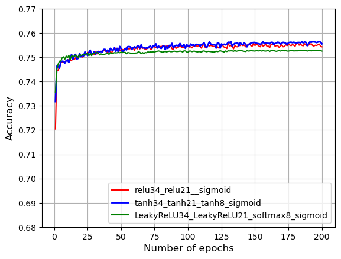</td><td>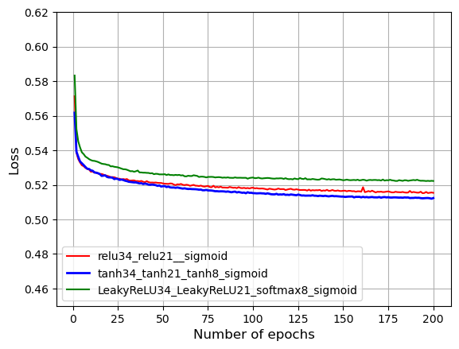</td></tr></table>

**Fig. 5 Comparison of (a) Accuracy and (b) Loss of the DNN models with 2 vs. 3 hidden layers and different activation functions (Total neurons in input-layer1-layer2-(layer3): 42-34-21 or 42-34-21-(8). Total epochs: 200).**
<hr>

Fig. 5 provides the comparison across three different DNN models after implementing the optimization techniques. All models were analyzed using identical settings, 200 epochs and 42-34-21 or 42-34-21-(8) (3<sup>rd</sup> hidden layers). The numbers refer to neurons in input-layer1-layer2 for two hidden layer case or input-layer1-layer2-(layer3) for three hidden layer case. The DNN models analyzed in Fig. 5 are as follows.

- **DNN Model 1** used activation functions called 'relu' for hidden layers and 'sigmoid' for the output layer (*relu34_relu21_sigmoid* in Fig. 5).
- **DNN Model 2** used activation functions called 'tanh' for hidden layers and 'sigmoid' for the output layer (*tanh34_tanh21_tanh8_sigmoid* in Fig. 5).
- **DNN Model 3** used activation functions called 'LeakyReLU' and 'softmax' for hidden layers and 'sigmoid' for the output layer (*LeakyReLU34_LeakyReLU21_softmax8_sigmoid* in Fig. 5).

<hr>
<table><tr><td>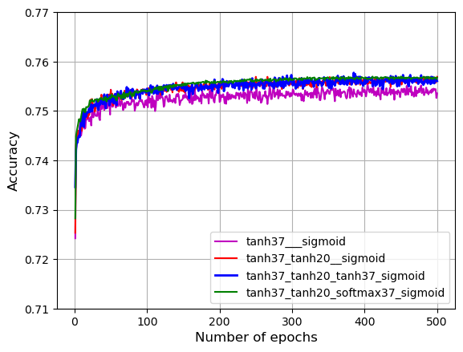</td><td>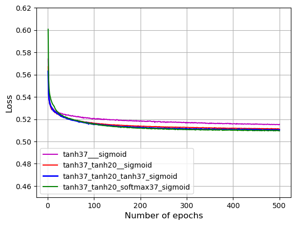</td><td>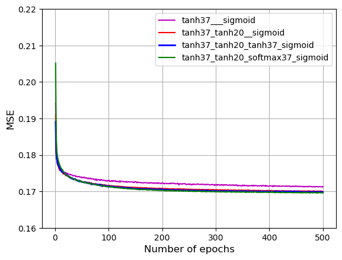</td></tr></table>

**Fig. 6 Comparison of (a) Accuracy, (b) Loss, and (c) MSE of four DNN models with 1&ndash;3 hidden layers and the best performing 'tanh' activation function (Total neurons in input-layer1-layer2-(layer3): 41-37, 41-37-20, or 41-37-20-(37). Total epochs: 500).**
<hr>

Fig. 6 illustrates the comparison between models with single hidden layer vs. multiple hidden layers and 'tanh' vs. 'softmax' activation functions when evaluated using identical number of neurons and epochs. The DNN models analyzed in Fig. 6 are as follows.

- **DNN Model 1** used activation functions called 'tanh' for the single hidden layer and 'sigmoid' for the output layer (*tanh37_sigmoid* in Fig. 6).
- **DNN Model 2** used activation functions called 'tanh' for hidden layers and 'sigmoid' for the output layer (*tanh37_tanh20_tanh37_sigmoid* in Fig. 6).
- **DNN Model 3** used activation functions called 'tanh' for hidden layers and 'sigmoid' for the output layer (*tanh37_tanh20_tanh37_sigmoid* in Fig. 6).
- **DNN Model 4** used activation functions called 'tanh' and 'softmax' for hidden layers and 'sigmoid' for the output layer (*tanh37_tanh20_softmax37_sigmoid* in Fig. 6).

These results reconfirmed that:

- at least 2 hidden layers are necessary to reach an optimal predictive accuracy of over 75% for training and testing our dataset.
- the model using 'tanh' activation functions performed better than the rest of models in terms of accuracy, loss, MSE, and convergence rate. 'LeakyReLU' or 'softmax' algorithm was the worst performer amongst all models for achieving the target model performance and barely exceeded the 75% accuracy level.
- no significant difference between adding 2 vs. adding 3 hidden layers or extra number of neurons in each hidden layer.

## Summary

All deliverables have been completed and analyzed according to the assignment requirements, including implementation of reusable functions that enable efficient experimentation on NN/DNN models, code refactoring, properly formatted outputs and graphs, and quality assurance for ensuring accurate results. As for visualizing the dataset and analysis results of multiple NN/DNN models, I employed the popular Matplotlib libraries to perform effective and visually impactful visualizations. The complete analysis results and visualizations were detailed and discussed in the [Results](#results) subsection.

### Data Preprocessing

Here are the preprocessing techniques that I adopted to optimize the predictive accuracy of our NN/DNN models and the answers to the following questions.

- What variable(s) are considered the target(s) for your model?
  - *IS_SUCCESSFUL* was set as the target for training and testing the NN and DNN models in this study.
- What variable(s) are considered to be the features for your model?
  - *APPLICATION_TYPE*, *AFFILIATION*, *CLASSIFICATION*, *USE_CASE*, *ORGANIZATION*, *STATUS*, *INCOME_AMT*, *SPECIAL_CONSIDERATIONS*, *ASK_AMT* were specified as the features for training and testing the NN and DNN models in this study.
- Which feature(s) are required to be normalized or adjusted further for improving the predictive accuracy of our NN/DNN models?
  - For optimizing the predictive accuracy of our NN/DNN models, removal of high outliers from one of the numerical features (*ASK_AMT*) whose values were 1.5 IQR above the third quartile was implemented.
  - Based on the knee point of the *APPLICATION_TYPE* counts as illustrated in Fig. 1, choosing T8 (737) or T7 (725) instead of T10 (528) as the knee point might be an alternative for minimizing the number of bins.
- What variable(s) are neither targets nor features, and should be removed from the input data?
  - We dropped the non-beneficial ID columns, *EIN* and *NAME*, from the input data.

### Summary on Compiling, Training, and Evaluating the Model

Here are the optimization solutions that I adopted to optimize the predictive accuracy of our NN/DNN models and the answers to the following questions.

- How many neurons, layers, and activation functions did you select for your neural network model, and why?
  - I increased the neurons within 0.7x&ndash;1x of the number of input features in each hidden layer, used 2&ndash;3 hidden layers, and leveraged the 'tanh' activation function because they earned us the best and most stable results based on our preliminary assessments (Fig. 6). Applying a huge number of neutrons and layers could inversely trigger noise, underfitting, or overfitting, and probably made the model difficult to stabilize and converge as we have observed with our models (Fig. 7).
- Were you able to achieve the target model performance?
  - Yes, the optimized model was able to achieve the target model performance. With just 200 epochs, we could achieve a predictive accuracy around 75.6%, which was a **2.3%** improvement compared to our initial results (Fig. 5&ndash;6).
- What steps did you take to try and increase model performance?
  1. Removed high outliers from *ASK_AMT* data whose values were 1.5 IQR above the third quartile by using the following code snippet. The &pm;3 $\sigma$ approach is another way of filtering possible outliers, though this alternative did not earn any improvement for our dataset.
  2. Increased the number of epochs, for example from 100/200 to 500 or higher, but higher epochs triggered higher cost because the runtime performance would get significantly worse.
  3. Used 'tanh' activation function in all the hidden layers instead of rectified linear unit (ReLU), leaky ReLU, or softmax algorithms.
  4. Optimized the number of neurons in each hidden layers, so that they stayed within 0.7x&ndash;1x of the number of input features in our dataset.
  5. Reduced the binning of *APPLICATION_TYPE* counts by one or two based on the knee curves (Fig. 1). I also applied three hidden layers, however, adding more hidden layers did not seem to contribute much for this case study. Two hidden layers seems to have been optimal for our dataset considering our analysis results (Fig. 6).

<hr>
<table><tr><td>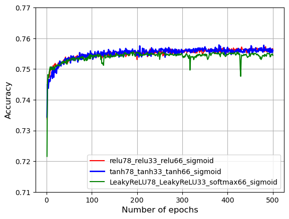</td><td>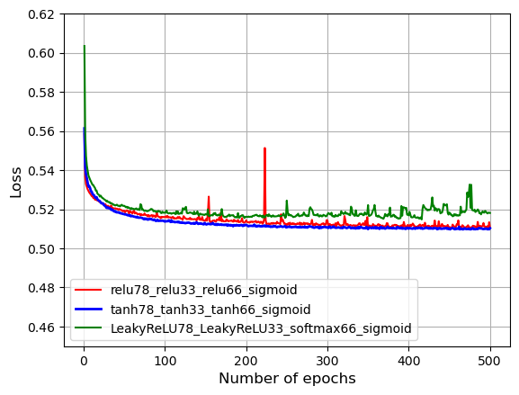</td><td>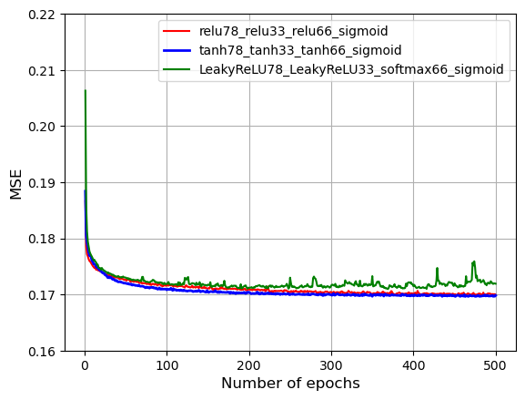</td></tr></table>

**Fig. 7 Comparison of (a) Accuracy, (b) Loss, and (c) MSE of three DNN models with 3 hidden layers and number of neurons higher than the number of input features (Total neurons in input-layer1-layer2-layer3: 41-78-33-66. Total epochs: 500).**
<hr>

### Conclusion and Recommendation

During this project, we basically ran massive iterations of experiments for evaluating the effectiveness of each model that we have devised, but we would need to have an effective toolbox that lets us better estimate the optimal number of batch sizes, estimators, classifiers, hidden layers, neurons, and epochs when dealing with the real-world problems. And finally, here are a few recommendations that I would like to share.

- Adding more epochs, hidden layers, and neurons may not necessarily earn us better predictive accuracy and model performance in our dataset as well as some other case studies. It slows down the TensorFlow processing time further and will only result in significantly worse runtime performance (cost-ineffective).
- Using a better approach for tuning the hyper-parameters in our NN/DNN models. We could try `GridSearchCV`, `HalvingGridSearchCV`, or `HalvingRandomSearchCV` estimators available in Scikit-learn packages ([Tuning the hyper-parameters of an estimator](https://scikit-learn.org/stable/modules/grid_search.html#grid-search)).
- Using a more efficient code for sequentially running experiments, saving analyzing results, and creating visualizations at once. The proof of concept was implemented early on and discussed in [Using Deep Neural Networks](#using-deep-neural-networks). The source code can be reviewed in [AlphabetSoupCharity_Optimization.ipynb](./AlphabetSoupCharity_Optimization.ipynb), which I kicked off to accomplish the "Compiling, Training, and Evaluating the Model" steps and visualizations while at work.

## References

[Pandas User Guide](https://pandas.pydata.org/pandas-docs/stable/user_guide/index.html#user-guide)  
[TensorFlow Documentation](https://www.tensorflow.org/guide/)  
[Scikit-learn User Guide - Unsupervised Learning](https://scikit-learn.org/stable/unsupervised_learning.html)  
[Scikit-learn User Guide - Supervised Learning](https://scikit-learn.org/stable/supervised_learning.html)  
[Matplotlib - Plot types](https://matplotlib.org/stable/plot_types/index.html)  
[Save model every 10 epochs tensorflow.keras v2](https://stackoverflow.com/questions/59069058/save-model-every-10-epochs-tensorflow-keras-v2)  
[Estimating the number of neurons and number of layers of an artificial neural network](https://stackoverflow.com/questions/3345079/estimating-the-number-of-neurons-and-number-of-layers-of-an-artificial-neural-ne/3345770#3345770)  
[Tuning the hyper-parameters of an estimator](https://scikit-learn.org/stable/modules/grid_search.html#grid-search)  
